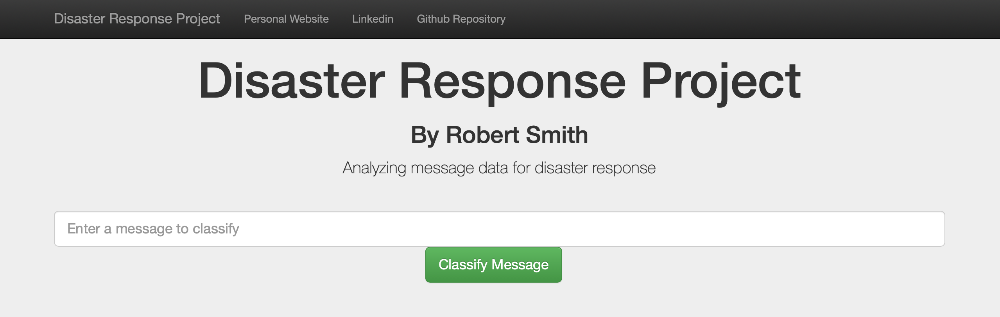

# Disaster Response Pipeline Project
*Created as part of Udacity's Data Scientist Nanodegree Program*

### Background 
Being able to properly identify and respond to people's needs during a disaster (such as a flood, tornado, etc.) is 
critical to reducing human casualties and suffering. [Figure Eight](https://appen.com) (now appen) has provided over 
26,000 real-world disaster response text and twitter messages and classified them into 36 categories. Using this data, 
the purpose of this project is to accomplish three key tasks:
1. Write an ETL pipeline that cleans and merges the messages.csv and categories.csv files into a Sqlite database.
2. Train a machine learning model pipeline to classify/categorize messages sent during disaster events.
3. Build a Flask application that allows a user to enter a message and run the model pipeline. The application 
developed is shown in the figure below:
  


### Repository Contents
```bash
.
├── README.md
├── app                                 # Disaster response Flask application files
│   ├── run.py
|   ├── flask_app.png
│   └── templates
│       ├── go.html
│       └── master.html
├── data                                # Raw data, etl script, and sqlite database
│   ├── categories.csv
│   ├── disaster_response.db
│   ├── messages.csv
│   └── process_data.py
├── models                              # Model training script, performance results, and picked classifier
│   ├── classifier.pkl
│   ├── f1_score_performance.png
│   ├── model_performance.csv
│   └── train_classifier.py
├── notebooks                           # Experimentation notebooks
│   ├── ETL Pipeline Preparation.ipynb
│   ├── ML Pipeline Preparation.ipynb
└── requirements.txt


```

### Project Set-up:
**Python Version:** 3.8.1  
  
To run the etl and model training script and launch the Flask application, create a clean virtual environment and 
install the package requirements:   
```bash 
pip install -r requirements.txt 
```

### Instructions:
1. Run the following commands in the project's root directory to set up your database and model.

    - To run ETL pipeline that cleans data and stores in database
        `python data/process_data.py data/messages.csv data/categories.csv data/disaster_response.db`
    - To run ML pipeline that trains classifier and saves
        `python models/train_classifier.py data/disaster_response.db models/classifier.pkl`

2. Run the following command in the app's directory to run your web app.
    `python run.py`

3. Go to http://0.0.0.0:3001/
